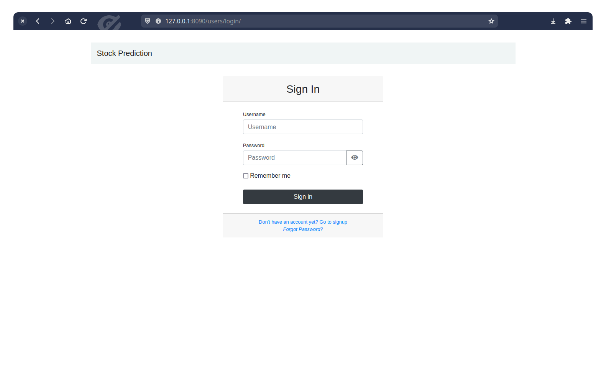
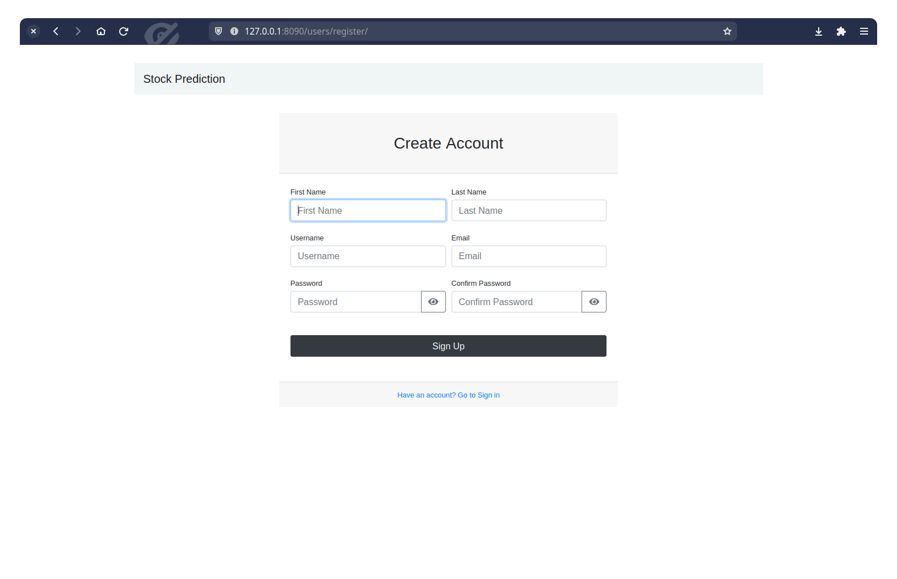
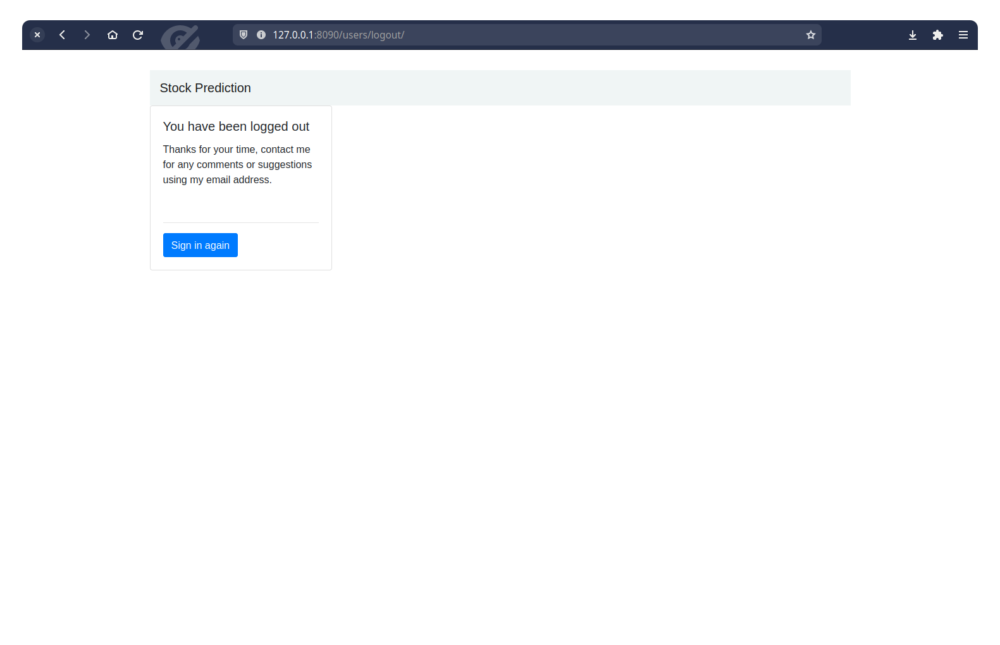
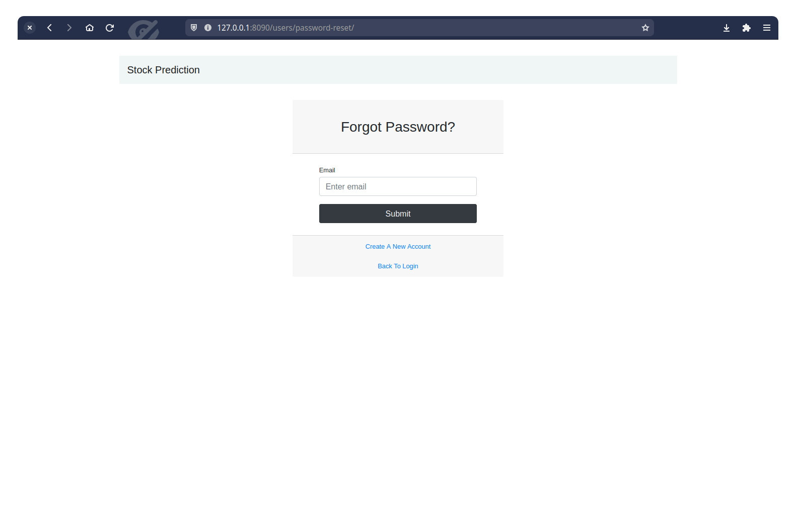
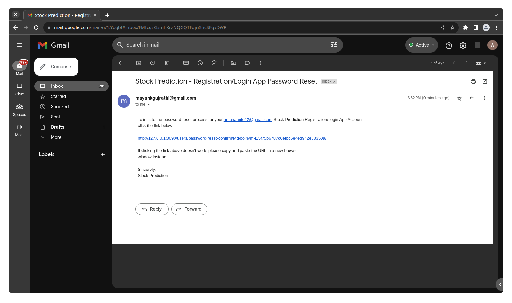
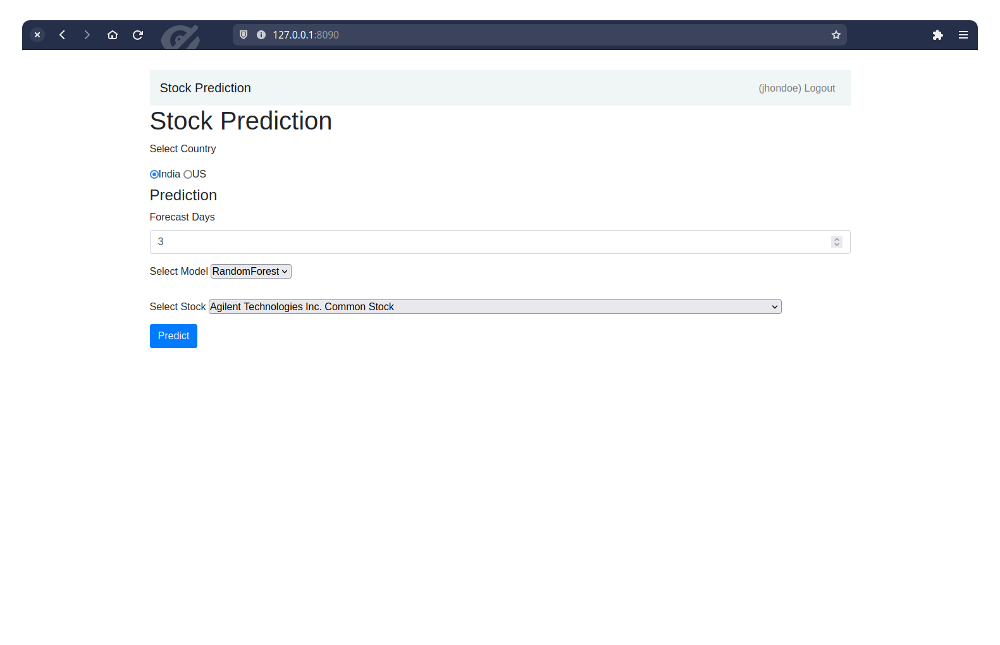
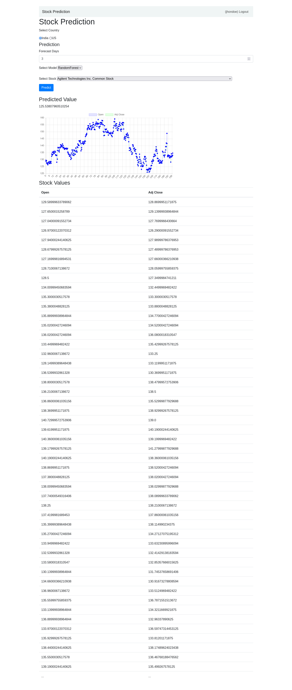
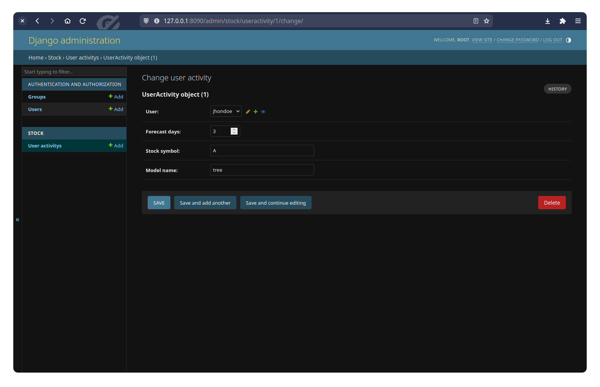

# Stock Prediction
A Simple DJango Application which is capable of adding new users and help them predict stocks (Data from Yahoo Finance)

## Algorithms
Algorithms used for Stock Prediction are

1. Support Vector Machine Regressor
2. Random Forest Regressor

## Working Screenshorts
### Login Page

### Signin Page

### Logout Page

### Forget Password Page

### Password Reset Email

### Home Page

### Prediction Page

### Stored User Activity in Database

Data
We have used yfinance to get the stock information, and visualized different aspects of it using Seaborn and Matplotlib.

Tech Stack/Frameworks
Data Cleaning: NumPy, Pandas

Visualization: Matplotlib, Seaborn

Deep Learning Models: Long Short Term Memory (LSTM)

Contributions
Contributions to this project are welcome! If you have any suggestions, improvements, or new features to add, please open an issue or submit a pull request.

Acknowledgements
This project makes use of the following open-source libraries and frameworks:

Pandas: https://pandas.pydata.org/

NumPy: https://numpy.org/

Matplotlib: https://matplotlib.org/

Seaborn: https://seaborn.pydata.org/

Keras: https://keras.io/

We would like to express our gratitude to the developers of these tools for their invaluable contributions to the open-source community.
